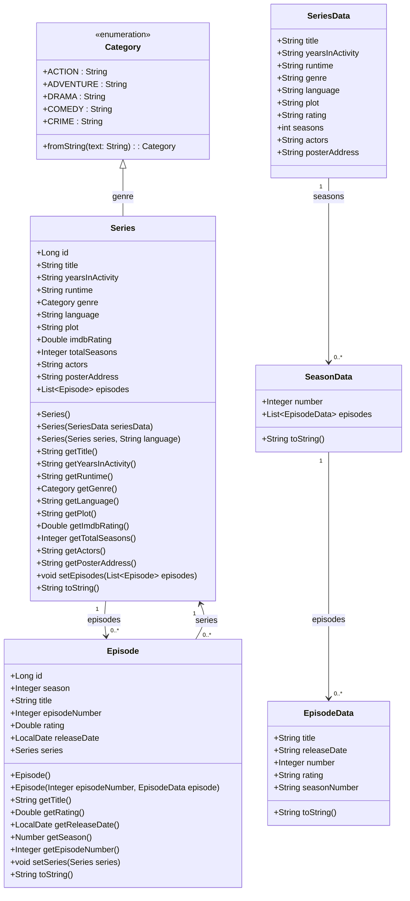

# ScreenMatch - Seu gerenciador de séries e filmes!

**Descrição:**

O ScreenMatch é um back-end robusto em Java com Spring, construído para gerenciar e pesquisar títulos cinematográficos. Atualmente, focamos em séries e seus episódios, mas temos grandes planos para o futuro!

**Funcionalidades Atuais:**

- **Cadastro de Séries:** Cadastre suas séries favoritas com todos os detalhes: título, gênero, número de temporadas, atores e muito mais!
- **Busca de Séries:** Encontre rapidamente as séries que você procura, mesmo digitando apenas parte do título. A busca é case-insensitive (ignora maiúsculas e minúsculas).
- **Busca de Episódios:** Localize episódios específicos dentro de uma série.
- **Listagem de Séries:** Veja todas as séries cadastradas de forma organizada.

**Tecnologias:**

- Java
- Spring Data JPA
- PostgreSQL
- Java Stream API ️

# Modelo de domínio (Mermaid)

**Funcionalidades Futuras:**

- **Avaliação de Séries e Episódios:** Avalie seus títulos favoritos e compartilhe sua opinião!
- **Interface Gráfica:** Uma interface amigável para facilitar a interação com o sistema.
- **Suporte a Filmes:** Expanda o ScreenMatch para incluir filmes em sua base de dados.
- **E muito mais... **

**Contribuições:**

Contribuições são bem-vindas! Sinta-se à vontade para abrir issues e pull requests.